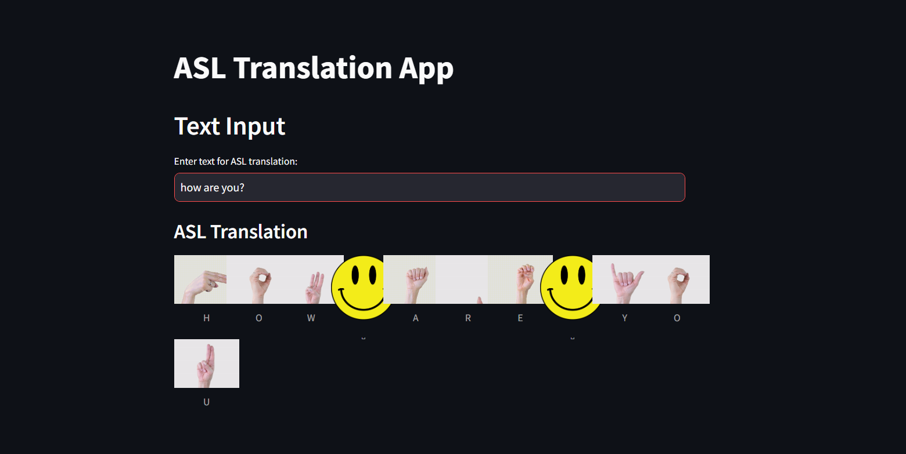

# ASL Translation App

## Overview
The ASL Translation App is a simple web application developed using Streamlit. It translates English text into American Sign Language (ASL) signs. This application is especially useful for learning the ASL alphabet and how to sign basic phrases and words.

## Screenshot


## Features
- Translate alphabets and numbers from text to ASL images.
- Provides a visual representation for each character including spaces.
- Easy-to-use text input for quick translation.

## Features
- Translate alphabets and numbers from text to ASL images.
- Provides a visual representation for each character including spaces.
- Easy-to-use text input for quick translation.

## Installation

Before you can run the app, you need to install the necessary Python packages.

### Requirements
- Python 3.6+
- Streamlit
- Other dependencies as listed in `requirements.txt`

### Setup

1. Clone the repository:
   ```bash
   git clone https://github.com/emanmunir/ASL-Translation.git
   cd ASL-Translation
   ```

2. Install the required Python packages:
   ```bash
   pip3 install -r requirements.txt
   ```

## Running the Application

To run the app, navigate to the project directory in your terminal and run:
```bash
streamlit run app.py
```

The application will start, and you can access it by navigating to `http://localhost:8501` in your web browser.

## Usage

To use the app:
1. Enter text in the input box labeled 'Enter text for ASL translation:'
2. Press Enter or wait for the app to automatically process the input.
3. View the translated ASL signs displayed below the input box.

## License
Include your license information here.

## Contributing
Contributions to the ASL Translation App are welcome. Please feel free to fork the repository, make improvements, and submit pull requests.

## Contact
For bugs, suggestions, or additional information, please open an issue in the repository.
